# 🚦 스마트 교통 관리 시스템 (Smart Traffic Management System)

스마트 교통 관리 시스템 프로젝트는 라즈베리파이5 환경에서 YOLO 기반 객체 인식과 OpenCV 영상처리를 활용하여  
도로 상황을 실시간으로 분석하고, 무단횡단 / 불법 주정차 / 불법 유턴 / 낙상사고 / 비상상황 등의 교통 위반 이벤트를 감지 및 저장하는 통합 시스템입니다.

---

## 📌 프로젝트 개요

- **수행 기간:** 2026.03.06 ~ 2026.03.21
- **사용 기술:**
  - Python
  - YOLOv8
  - OpenCV
  - Raspberry Pi5
  - SQLite
  - Arduino IDE
  - Arduino MEGA 2560 R3
  - XPT2046 Touch Controller
  - INTEL RealSense Depth Camera D435i
  - PILOMAX USB 웹캠

- **주요 기능:**
  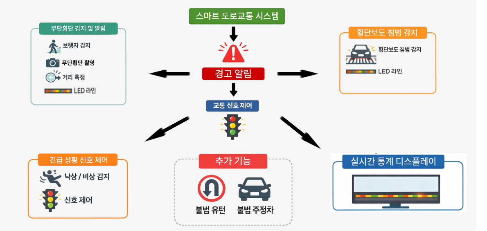
  - 무단횡단 감지
  - 불법 주정차 감지
  - 불법 유턴 감지
  - 낙상 감지
  - 긴급 차량 처리
  - 이벤트 이미지 저장
  - 로그 데이터 기록 및 일별 통계 관리
 
  

---

## 🛠 기술 스택

| 기술 | 설명 |
|------|------|
| Python | 전체 시스템 로직 및 영상 처리 구현 |
| YOLOv8 | 객체 탐지 모델 기반 보행자/차량 인식 |
| OpenCV | ROI 표시, 대시보드 구성, 이미지 저장, 색 기반 신호 판별 |
| Raspberry Pi5 | 임베디드 환경에서 실시간 시스템 구동 |
| INTEL RealSense Depth Camera D435i | 사람 객체와 횡단보도 중앙까지의 실제 거리 측정 및 이벤트 판별 |
| XPT2046 Touch Controller | 라즈베리파이 환경에서 디스플레이 사용 |
| SQLite | 이벤트 로그 및 일별 통계 저장 |
| Serial Communication | 외부 장치와의 상태 제어 및 연동 |
| Arduino IDE| LED 및 네오픽셀 제어 (Arduino MEGA 2560 R3 제어)|
| PILOMAX USB 웹캠| 사각지대 무단횡단 캡처 (인텔카메라와 같이 사용하여 카메라 2대 동시제어) |

---

## 📋 기능 설명

### 1. 횡단보도 무단횡단 감지
- 보행자와 신호 상황을 기반으로 무단횡단 여부 판단
- 이벤트 발생 시 이미지 저장 및 DB 기록
- 동일 인물 반복 인식에 따른 중복 카운트를 방지하기 위해 쿨타임 적용
- 야간에는 네오픽셀 LED 빨간등 점등

### 2. 차도 무단횡단 감지
- 신호 상황과 상관없이 횡단보도 외 차도로 침입 시 무단횡단 판단
- 이벤트 발생 시 이미지 저장 및 DB 기록
- 동일 인물 반복 인식에 따른 중복 카운트를 방지하기 위해 쿨타임 적용

### 3. 차량 횡단보도 침범
- 차량과 신호 상황을 기반으로 횡단보도 침범시 판단
- 야간에는 네오픽셀 LED 파란등 점등

### 4. 불법 주정차 감지
- 차량이 지정 구역 내 일정 시간 이상 정차할 경우 이벤트 처리
- 위반 차량 이미지 저장 및 로그 기록

### 5. 불법 유턴 감지
- 차량 이동 방향과 관심 구역을 기준으로 불법 유턴 여부 판단
- 감지 결과를 이미지와 함께 저장

### 6. 낙상 사고 감지
- 낙상 감지 시 비상 상태를 유지
- 일반 이벤트 처리와 구분하여 예외적으로 동작

### 7. 긴급 차량 처리
- 긴급 차량 인식 시 비상 상태를 일정 시간 유지
- 차량 신호 3개 모두 점등하여 비상상태임을 알림
- 일반 이벤트 처리와 구분하여 예외적으로 동작

### 8. 데이터 저장 및 통계 관리
- 이벤트 발생 시 발생 시간, 이미지 경로, 이벤트 종류를 저장
- 날짜별 누적 통계를 관리하여 추후 분석 가능

---
## ⚙️ 전처리, 학습 사진

### 1. 실제 사람, 차량 학습 후 테스트
 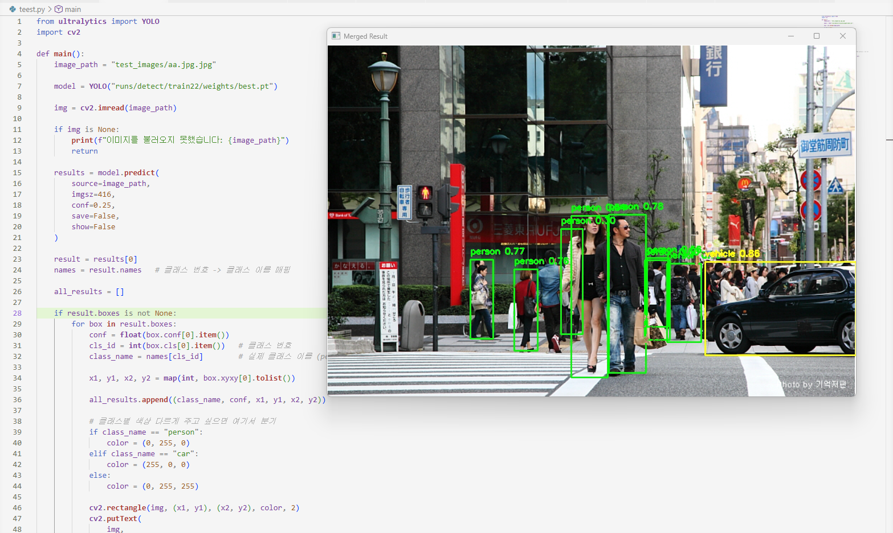

#### Roboflow 사이트에서 공공데이터 다운받아 학습진행

---

### 2. 모형 데이터 라벨링 및 학습완료

 
 

#### 사진을 직접 촬영 하여 AnyLabeling-Windows-CPU-x64 툴을 사용하여 직접 데이터 라벨링 하여 학습진행

---

##  📷  실물 사진

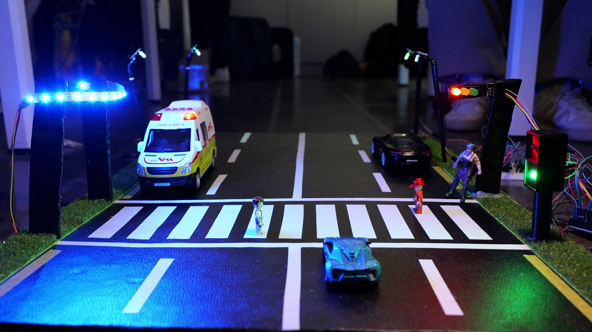

---

## 🧠 시스템 구성도

---

## 📂 소스 코드

### [소스코드 바로가기(상세코드설명포함)](https://github.com/ksi076/smart_road_management_system/tree/main/src)

---

## 🎥 시연 영상

### [횡단보도 무단횡단 감지 시연 (클릭 시 전체영상화면 재생)](https://drive.google.com/file/d/1JJZ4wy2REE9QvrCth4uMI0Oh-UzQre7v/view?usp=sharing)

 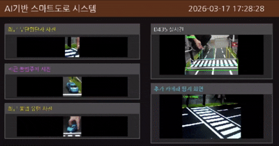
 

####차량신호등 빨간불에 사람객체가 횡단보도 ROI에 0.3 이상 침범 시 무단횡단 판정
####이후 디스플레이에 크롭하여 출력 및 야간엔 네오 픽셀 빨강 LED 점등

### [차도 무단횡단 감지 시연 (클릭 시 전체영상화면 재생)](https://drive.google.com/file/d/10VPleeBBzlbaidgrZ4XxjRO3DYnDbJa4/view?usp=sharing)

 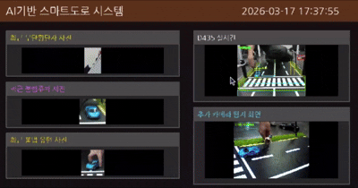
 

### [불법 주정차 감지 시연 (클릭 시 전체영상화면 재생)](https://drive.google.com/file/d/1wICn6sA5SGs-cMUMmPEFmAYt1xEubBA2/view?usp=sharing)

 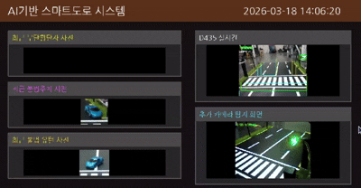
 

### [불법 유턴 감지 시연 (클릭 시 전체영상화면 재생)](https://drive.google.com/file/d/1-yff9gF1twIYAe5XEUdBGuQiPEu5qhGJ/view?usp=sharing)

 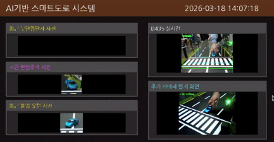
 

### [차량 횡단보도 침범 (클릭 시 전체영상화면 재생)](https://drive.google.com/file/d/1e-4tieU3bb9hKjmdHmfrGHj2JFM-pdN3/view?usp=sharing)

 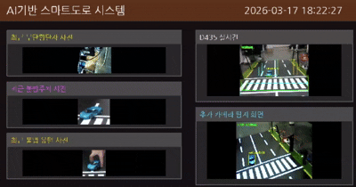
 

### [긴급상황 사고 (클릭 시 전체영상화면 재생)](https://drive.google.com/file/d/11_sgPJO63pYdR7drzoCO-xOwAlElfMGV/view?usp=sharing)

 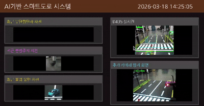
 

### [긴급 차 비켜주기 (클릭 시 전체영상화면 재생)](https://drive.google.com/file/d/1XEe5XvLOEKhPmtaGWWo1Pxdk5H6INKlp/view?usp=sharing)

 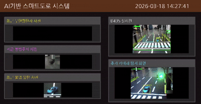
 

---

##  💻  디스플레이 및 야간 LED 사진

  
  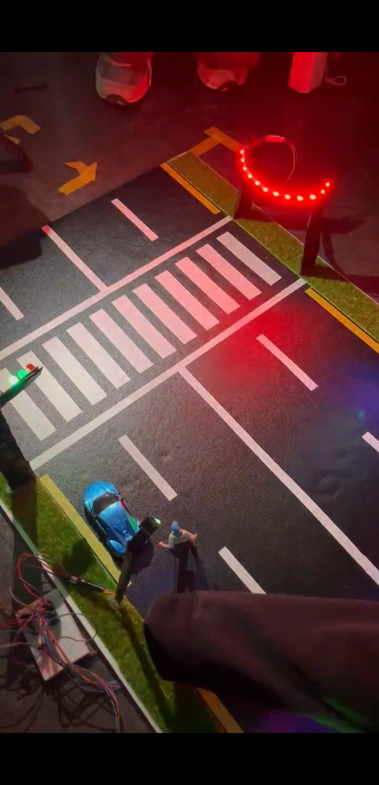
  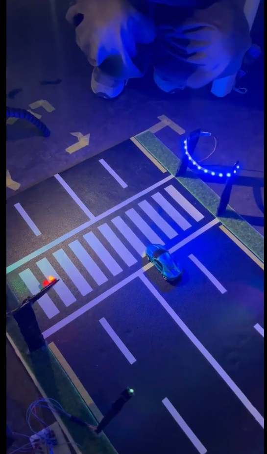

### 1. 디스플레이 (XPT2046 Touch Controller)
- 라즈베리파이5와 연결하여 UI화면 제어

### 2. 야간 무단횡단 감지
- 보행자 빨간불 또는 신호상관 없이 횡단보도 외 도로 침범 시 네오픽셀 빨간LED 점등

### 3. 야간 차량침범 감지
- 보행자 초록불 신호에 차량이 횡단보도 침범 시 네오픽셀 파란LED 점등

---

## 💾  데이터베이스 사진

### 1. 데이터베이스 테이블
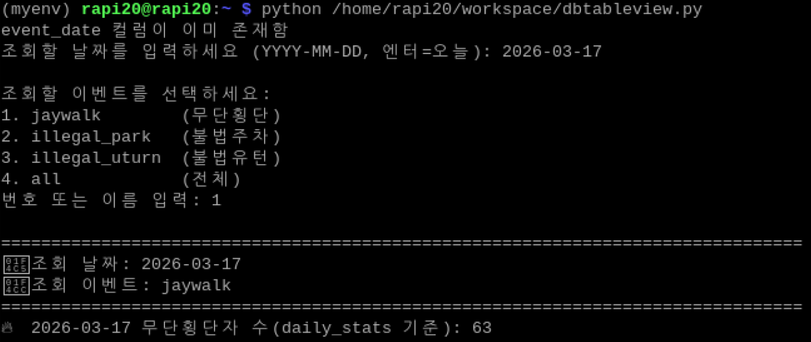
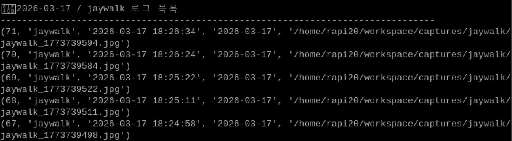

### 2. 데이터베이스 이미지
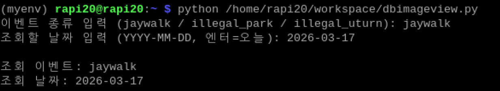
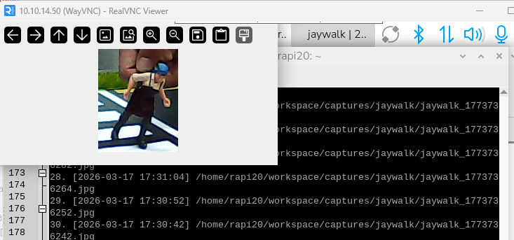

---

## ⚠️ 문제 해결 과정 (Trouble Shooting)

### 🚦 신호등을 사람으로 잘못 인식하는 문제

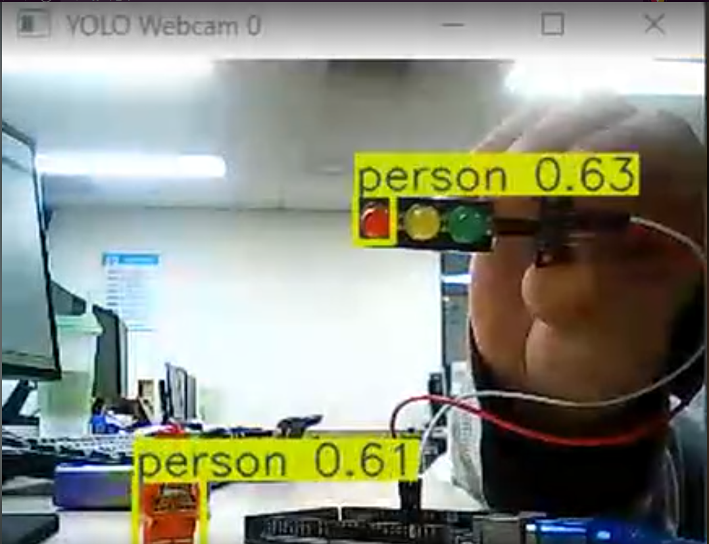
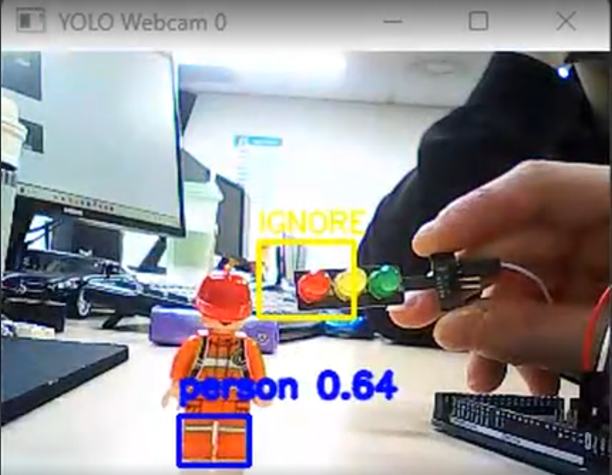

- **문제:** 빨간 사람 학습 후 신호등의 빨간 신호를 person클래스로 오탐  
- **해결:** 특정 ROI 영역 안의 person 감지를 continue하여 오탐 방지  

### 🚗  car클래스를 밤에 인식하지 못하는 문제

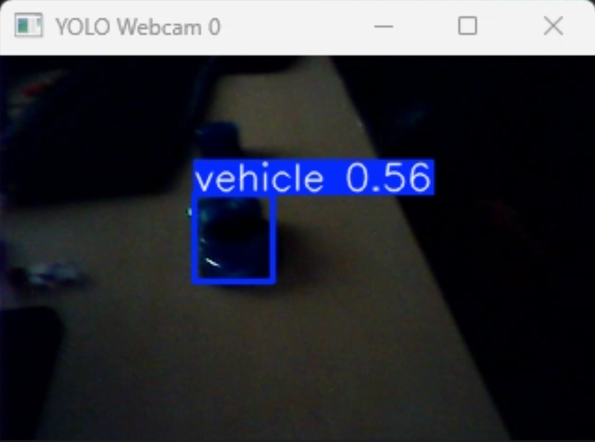
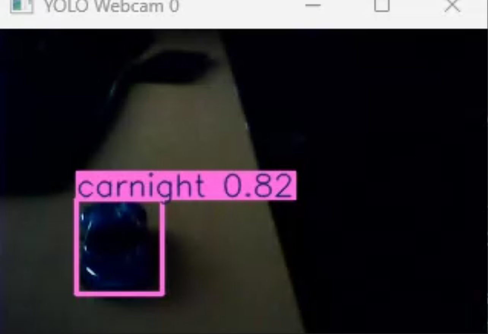

- **문제:** 낮과 밤을 묶어 vehicle 클래스를 학습시킨 결과 밤에 vehicle 클래스를 인식하지 못함  
- **해결:** 낮과 밤을 클래스로 나눠 학습하여 해결 → vehicle, carnigh 클래스로 분류  

### 🚶  사람을 인식하지 못하는 문제

- **문제:** 카메라 2대를 사용하기 때문에 카메라 속도 유지를 위해 YOLO5n을 사용하자 인식하지 못함  
- **해결:** YOLO8s로 학습하여 인식못하는 문제를 해결하고 학습완료된 best.pt 파일을 best.onnx 파일로 교체하여 속도문제를 해결
---

## 📈 향후 개선 방향

- 보행자 세분화
  ex) 유모차, 휠체어, 보행 보조기
- 도로에서의 위험 요소 인식
  ex) 낙하물 및 장애물, 쓰레기, 타이머, 동물 등
- 자율주행 및 스마트차량
  ex) V2X(vehicle to Everything)통신 연동
