````md
# 🚦 스마트 교통 관리 시스템  
### Smart Traffic Management System

> YOLOv8 객체 인식과 OpenCV 영상처리를 활용하여  
> 무단횡단, 불법 주정차, 불법 유턴, 차량 횡단보도 침범, 낙상 사고, 긴급 차량 상황을 실시간으로 감지하는 임베디드 기반 스마트 교통 관리 시스템입니다.

---

## 📌 프로젝트 요약

| 항목 | 내용 |
|---|---|
| 프로젝트명 | 스마트 교통 관리 시스템 |
| 수행 기간 | 2026.03.06 ~ 2026.03.21 |
| 개발 환경 | Raspberry Pi 5, Arduino MEGA 2560 R3 |
| 핵심 기술 | YOLOv8, OpenCV, SQLite, Serial Communication |
| 주요 장비 | Intel RealSense D435i, PILOMAX USB 웹캠, XPT2046 Touch Controller |
| 주요 기능 | 무단횡단 감지, 불법 주정차 감지, 불법 유턴 감지, 낙상 감지, 긴급 차량 처리 |

---

## 🧠 프로젝트 개요

본 프로젝트는 라즈베리파이5 환경에서 실시간 영상 분석을 수행하여 도로 위 다양한 위험 상황과 교통 위반 이벤트를 감지하는 시스템입니다.

YOLOv8 기반 객체 탐지 모델로 사람, 차량, 낙상, 긴급 차량 등을 인식하고, OpenCV를 활용해 ROI 영역 침범 여부와 신호 상태를 분석합니다.

이벤트가 발생하면 이미지와 로그 데이터를 SQLite에 저장하며, 디스플레이와 LED를 통해 현재 상황을 시각적으로 표시합니다.

---

## 🖼️ 전체 구성도

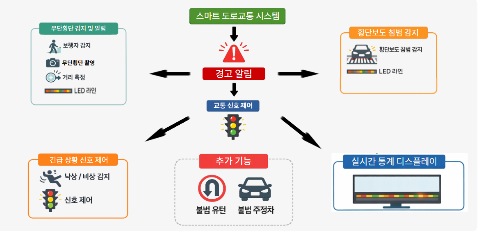

---

## ⚙️ 시스템 동작 흐름

```text
[카메라 입력]
D435i Depth Camera + USB Webcam
        ↓
[객체 인식]
YOLOv8 기반 사람 / 차량 / 낙상 / 긴급 차량 탐지
        ↓
[영상 처리]
OpenCV ROI 분석, 신호 상태 판별, 침범 비율 계산
        ↓
[이벤트 판단]
무단횡단 / 불법 주정차 / 불법 유턴 / 낙상 / 긴급 차량 처리
        ↓
[결과 처리]
이미지 저장, SQLite 로그 기록, 디스플레이 출력, LED 제어
````

---

## 🛠 기술 스택

| 구분                | 기술 / 장비                  | 역할                             |
| ----------------- | ------------------------ | ------------------------------ |
| Language          | Python                   | 전체 시스템 로직 및 영상 처리              |
| Object Detection  | YOLOv8                   | 사람, 차량, 낙상, 긴급 차량 탐지           |
| Vision Processing | OpenCV                   | ROI 설정, 침범 판단, 이미지 저장, 대시보드 구성 |
| Embedded Board    | Raspberry Pi 5           | 실시간 영상 처리 및 시스템 제어             |
| Camera            | Intel RealSense D435i    | 객체 인식 및 거리 측정                  |
| Camera            | PILOMAX USB 웹캠           | 사각지대 무단횡단자 캡처                  |
| Database          | SQLite                   | 이벤트 로그 및 일별 통계 저장              |
| Display           | XPT2046 Touch Controller | 라즈베리파이 UI 화면 출력                |
| MCU               | Arduino MEGA 2560 R3     | LED 및 네오픽셀 제어                  |
| Communication     | Serial Communication     | Raspberry Pi와 Arduino 간 상태 연동  |

---

## 🚦 주요 기능

### 1. 횡단보도 무단횡단 감지

* 차량 신호가 빨간불일 때 사람 객체가 횡단보도 ROI에 일정 비율 이상 침범하면 무단횡단으로 판단
* 이벤트 발생 시 이미지 저장 및 DB 기록
* 동일 인물 반복 감지를 방지하기 위해 쿨타임 적용
* 야간 상황에서는 네오픽셀 빨간 LED 점등
* D435i 카메라를 활용해 사람과 횡단보도 중앙 기준선 사이의 거리 출력

---

### 2. 차도 무단횡단 감지

* 신호와 관계없이 사람이 횡단보도가 아닌 차도 ROI에 침범하면 무단횡단으로 판단
* USB 보조 웹캠을 활용해 무단횡단자를 크롭하여 디스플레이 출력
* 이벤트 이미지와 시간 정보를 SQLite DB에 저장

---

### 3. 차량 횡단보도 침범 감지

* 차량 신호가 빨간불일 때 차량 객체가 횡단보도 ROI에 침범하면 위반으로 판단
* 야간 상황에서는 네오픽셀 파란 LED 점등
* 차량 침범 상황을 디스플레이에 표시

---

### 4. 불법 주정차 감지

* 차량이 불법 주정차 ROI에 일정 시간 이상 머무르면 불법 주정차로 판단
* 위반 차량 이미지를 크롭하여 저장
* 이벤트 발생 시간과 이미지 경로를 DB에 기록

---

### 5. 불법 유턴 감지

* 차량이 양쪽 도로 ROI에 순차적으로 침범하는 이동 패턴을 분석
* 일정 침범 비율 이상일 경우 불법 유턴으로 판단
* 감지 결과를 이미지와 함께 저장

---

### 6. 낙상 사고 감지

* YOLO 모델의 fall 클래스를 기반으로 낙상 사고 감지
* 일반 교통 위반 이벤트와 구분하여 비상 상황으로 처리
* 디스플레이에 긴급 상황 화면 출력

---

### 7. 긴급 차량 처리

* 경광등 ON 클래스 감지 시 긴급 차량 상황으로 판단
* 차량 신호등의 빨간불, 초록불, 노란불을 모두 점등하여 비상 상황 표시
* 일반 이벤트와 구분하여 우선 처리

---

### 8. 데이터 저장 및 통계 관리

* 이벤트 발생 시간, 이벤트 종류, 이미지 경로 저장
* SQLite 기반 로그 데이터 관리
* 날짜별 누적 통계 확인 가능

---

## 📷 실제 구현 모습

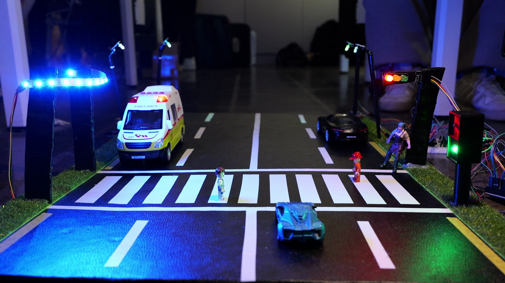

---

## 🧩 시스템 구성도

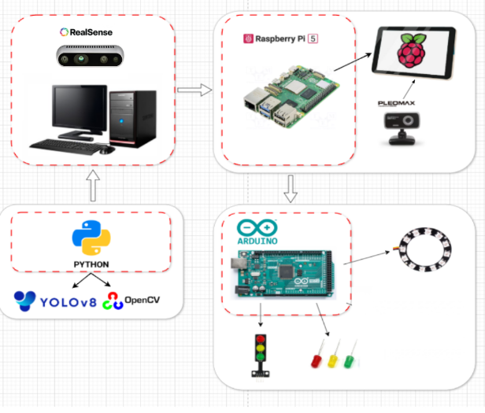

---

## 🧪 데이터 전처리 및 학습 과정

### 1. 실제 사람 / 차량 데이터 학습

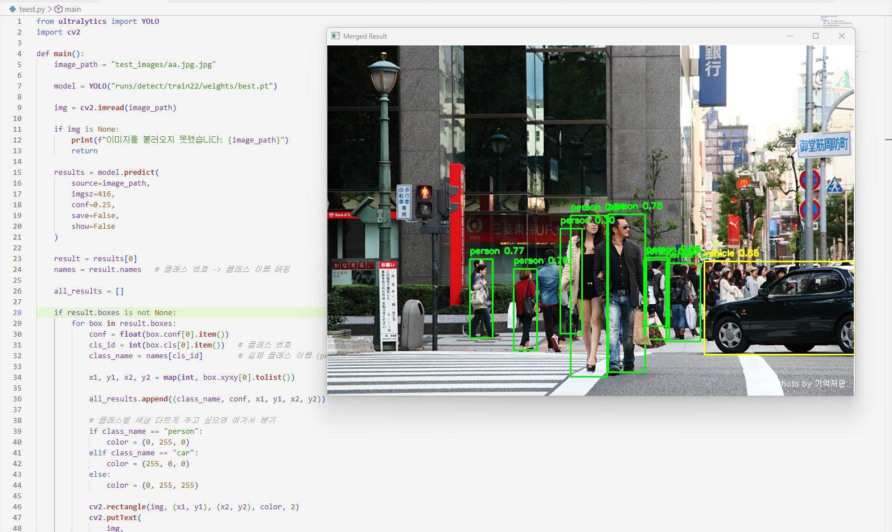

* Roboflow에서 공공 데이터를 수집하여 학습 진행
* 실제 도로 환경에서 사람과 차량 객체 인식 테스트 수행

---

### 2. 모형 데이터 라벨링 및 학습

<div>
  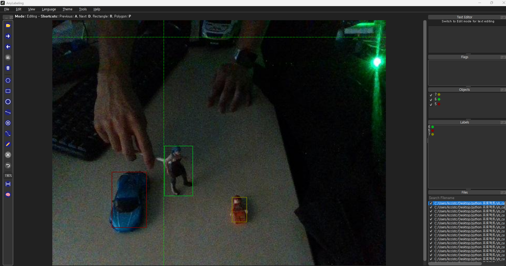
  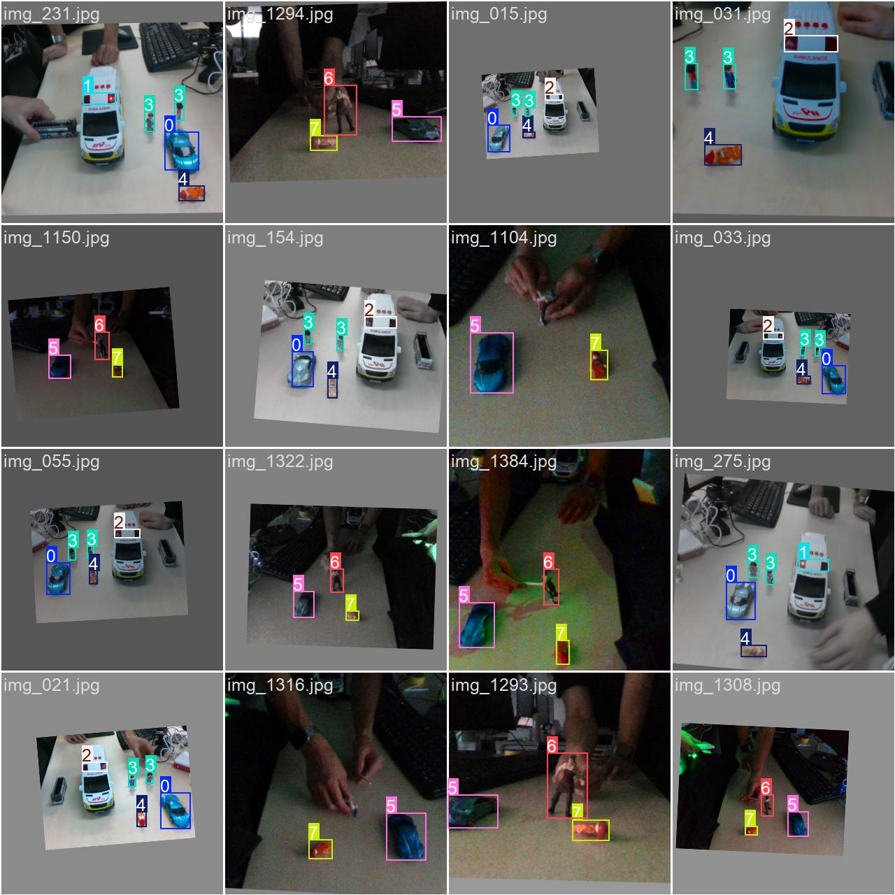
</div>

* 직접 촬영한 모형 데이터를 사용
* AnyLabeling-Windows-CPU-x64 툴을 활용하여 직접 라벨링
* 실제 시연 환경에 맞춘 커스텀 데이터셋 구성

---

## 🎥 시연 영상

### 1. 횡단보도 무단횡단 감지

[시연 영상 보기](https://drive.google.com/file/d/1JJZ4wy2REE9QvrCth4uMI0Oh-UzQre7v/view?usp=sharing)

<div>
  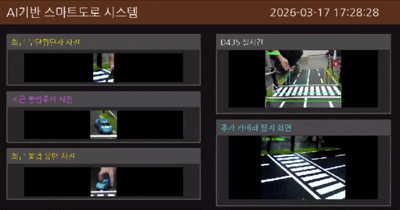
  
</div>

* 차량 신호등이 빨간불일 때 사람 객체가 횡단보도 ROI에 0.3 이상 침범하면 무단횡단으로 판단
* USB 보조 웹캠으로 무단횡단자를 크롭하여 디스플레이 출력
* 야간에는 네오픽셀 빨간 LED 점등
* DB에 이미지 및 시간 정보 저장
* D435i 카메라를 활용하여 횡단보도 중앙 기준선과 사람 사이의 거리 정보 출력

---

### 2. 차도 무단횡단 감지

[시연 영상 보기](https://drive.google.com/file/d/10VPleeBBzlbaidgrZ4XxjRO3DYnDbJa4/view?usp=sharing)

<div>
  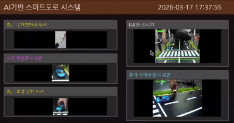
  
</div>

* 사람이 횡단보도가 아닌 차도 ROI에 0.3 이상 침범하면 무단횡단으로 판단
* 신호 상태와 관계없이 차도 침입 상황을 감지
* USB 보조 웹캠으로 위반자를 크롭하여 디스플레이 출력
* 이벤트 이미지 및 시간 정보 DB 저장

---

### 3. 불법 주정차 감지

[시연 영상 보기](https://drive.google.com/file/d/1wICn6sA5SGs-cMUMmPEFmAYt1xEubBA2/view?usp=sharing)

<div>
  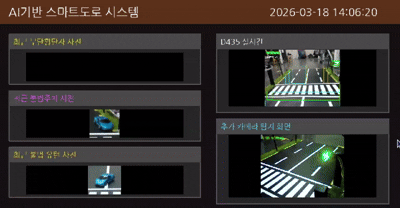
  
</div>

* 차량이 불법 주정차 ROI에 3초 이상 머무르면 불법 주정차로 판단
* D435i 카메라로 위반 차량을 크롭하여 디스플레이 출력
* DB에 이미지 및 시간 정보 저장

---

### 4. 불법 유턴 감지

[시연 영상 보기](https://drive.google.com/file/d/1-yff9gF1twIYAe5XEUdBGuQiPEu5qhGJ/view?usp=sharing)

<div>
  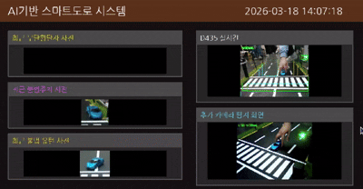
  
</div>

* 차량이 양쪽 도로 ROI에 각각 0.3 이상 침범하면 불법 유턴으로 판단
* 차량 이동 방향과 ROI 침범 패턴을 함께 분석
* 이미지 및 시간 정보 DB 저장

---

### 5. 차량 횡단보도 침범 감지

[시연 영상 보기](https://drive.google.com/file/d/1e-4tieU3bb9hKjmdHmfrGHj2JFM-pdN3/view?usp=sharing)

<div>
  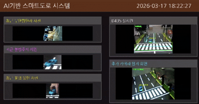
  
</div>

* 차량 신호가 빨간불일 때 차량이 횡단보도 ROI에 0.3 이상 침범하면 위반으로 판단
* 야간에는 네오픽셀 파란 LED 점등

---

### 6. 낙상 사고 감지

[시연 영상 보기](https://drive.google.com/file/d/11_sgPJO63pYdR7drzoCO-xOwAlElfMGV/view?usp=sharing)

<div>
  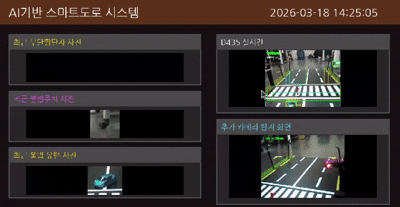
  
</div>

* fall 클래스 감지 시 긴급 사고 상황으로 판단
* 디스플레이에 비상 상황 화면 출력

---

### 7. 긴급 차량 처리

[시연 영상 보기](https://drive.google.com/file/d/1XEe5XvLOEKhPmtaGWWo1Pxdk5H6INKlp/view?usp=sharing)

<div>
  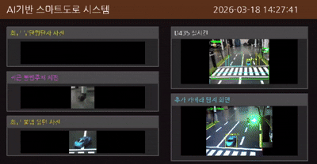
  
</div>

* 경광등 ON 클래스 감지 시 긴급 차량 상황으로 판단
* 디스플레이에 비상 상황 화면 출력
* 차량 신호 빨간불, 초록불, 노란불을 모두 점등하여 비상 상황 표시

---

## 💻 디스플레이 및 야간 LED 동작

<div>
  
  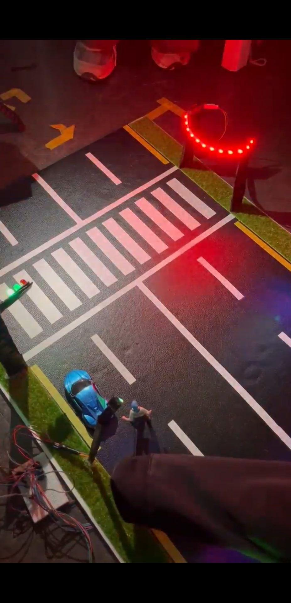
  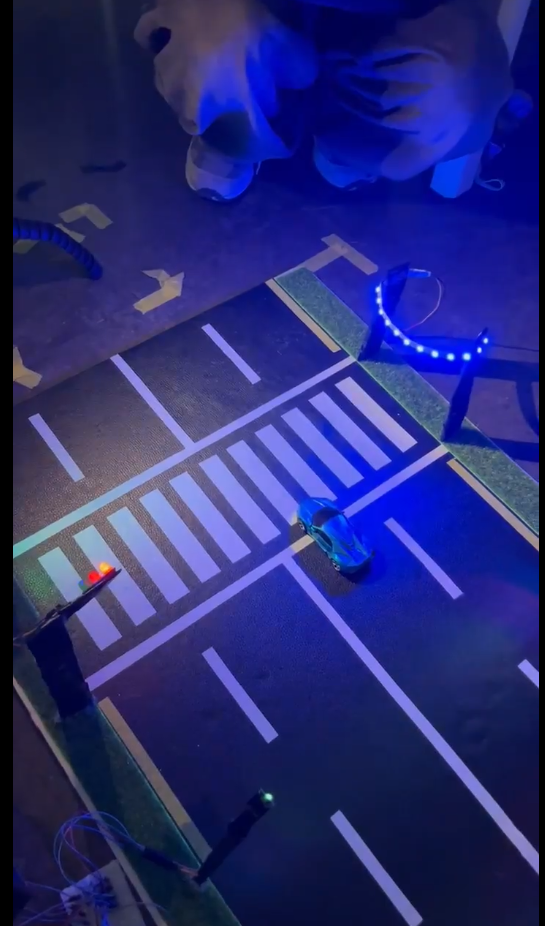
</div>

### 디스플레이

* XPT2046 Touch Controller를 라즈베리파이5와 연결
* 감지된 이벤트와 비상 상황을 UI 화면으로 출력

### 야간 무단횡단 감지

* 보행자 신호가 빨간불이거나 차도 무단횡단 발생 시 네오픽셀 빨간 LED 점등

### 야간 차량 침범 감지

* 보행자 신호가 초록불일 때 차량이 횡단보도를 침범하면 네오픽셀 파란 LED 점등

---

## 💾 데이터베이스 관리

### 데이터베이스 테이블

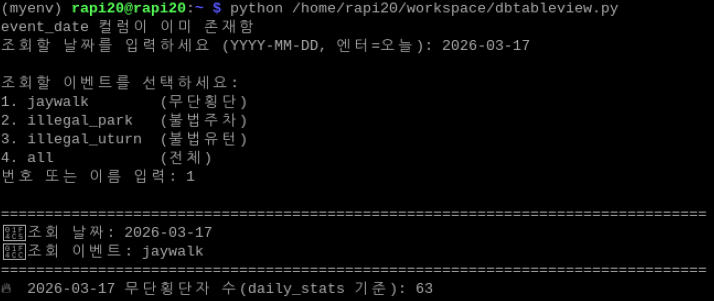
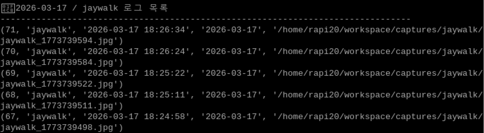

### 저장된 이벤트 이미지

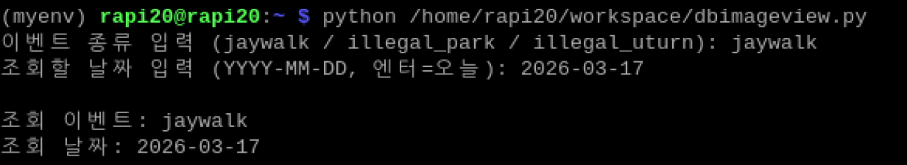
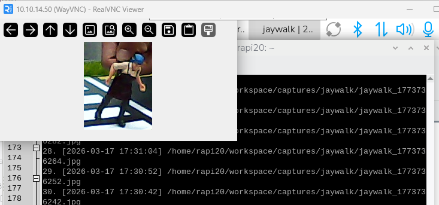

### 저장 데이터 예시

| 저장 항목      | 설명             |
| ---------- | -------------- |
| event_type | 감지된 이벤트 종류     |
| timestamp  | 이벤트 발생 시간      |
| image_path | 저장된 이벤트 이미지 경로 |
| count      | 날짜별 이벤트 누적 횟수  |

---

## ⚠️ 문제 해결 과정

### 1. 신호등을 사람으로 잘못 인식하는 문제

<p>
  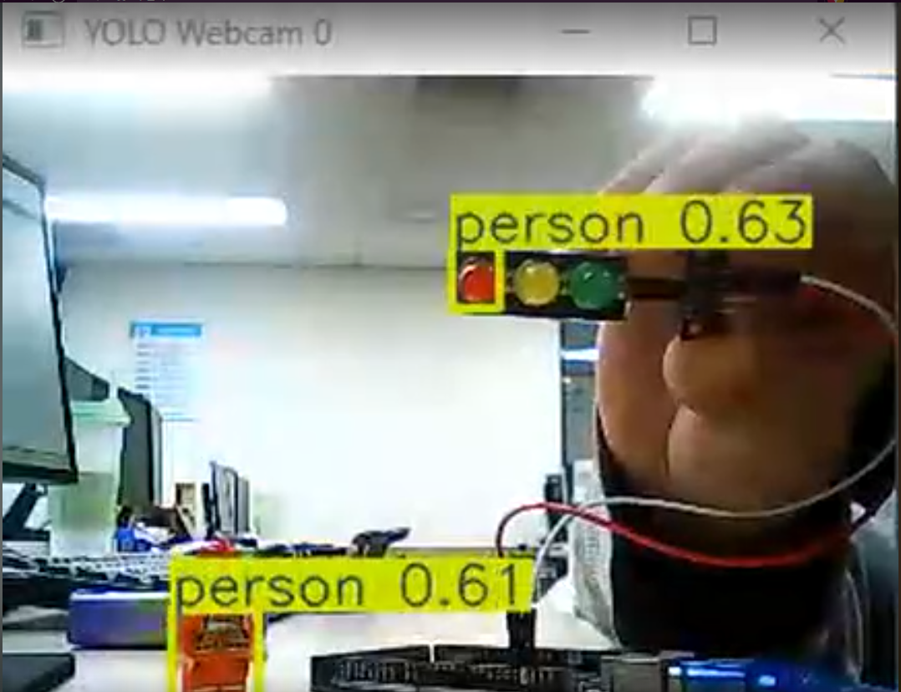
  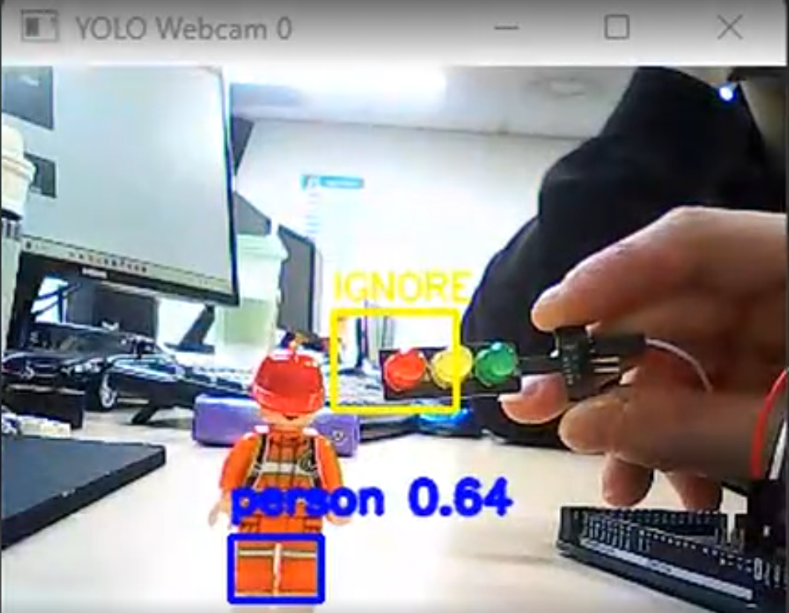
</p>

**문제**
빨간 사람 데이터를 학습한 뒤, 신호등의 빨간 신호를 person 클래스로 오탐하는 문제가 발생했습니다.

**해결**
신호등 위치에 해당하는 특정 ROI 영역 안에서 person 감지가 발생할 경우 해당 감지를 제외하도록 처리하여 오탐을 줄였습니다.

---

### 2. 야간에 차량을 인식하지 못하는 문제

<p>
  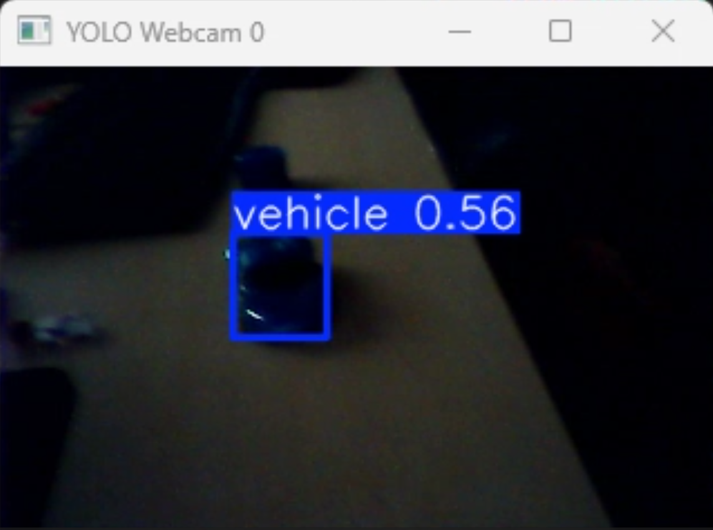
  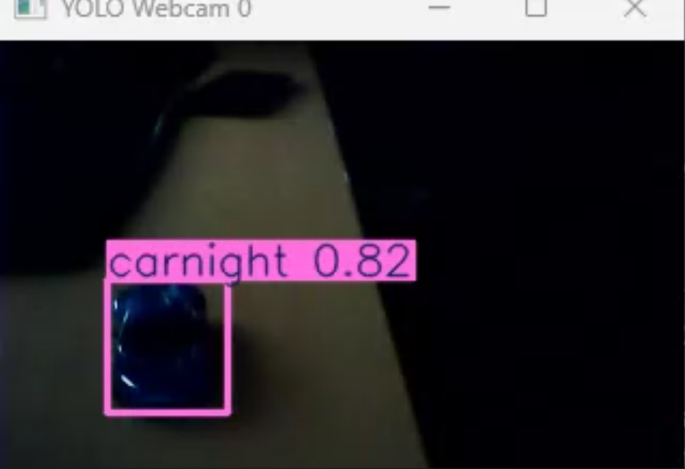
</p>

**문제**
낮과 밤의 차량 데이터를 하나의 vehicle 클래스로 학습한 결과, 야간 환경에서 차량 인식률이 낮아졌습니다.

**해결**
낮 차량과 야간 차량을 각각 vehicle, carnight 클래스로 분리하여 학습했고, 야간 차량 인식률을 개선했습니다.

---

### 3. 사람 객체 인식률 저하 문제

<p>
  
</p>

**문제**
카메라 2대를 동시에 사용하면서 속도 유지를 위해 YOLOv5n을 적용했지만, 사람 객체 인식률이 낮았습니다.

**해결**
YOLOv8s로 재학습하여 인식률을 개선했고, 학습된 best.pt 모델을 best.onnx로 변환하여 추론 속도 문제를 완화했습니다.

---

## 📈 향후 개선 방향

| 개선 방향      | 설명                                |
| ---------- | --------------------------------- |
| 보행자 세분화    | 유모차, 휠체어, 보행 보조기 사용자 등 교통약자 인식    |
| 위험 요소 인식   | 낙하물, 장애물, 쓰레기, 동물 등 도로 위 위험 요소 감지 |
| V2X 연동     | 자율주행차 및 스마트 차량과의 통신 연동            |
| 데이터 통계 시각화 | 이벤트 발생 빈도와 시간대별 분석 대시보드 구축        |
| 모델 경량화     | 라즈베리파이 환경에서 더 안정적인 실시간 추론 성능 확보   |

---

## 📂 소스 코드

[소스 코드 바로가기](https://github.com/mrgong0515/smart_road_management_system/tree/main/src)

---

## 👥 팀원 소개

<table>
  <tr>
    <td align="center">
      <a href="https://github.com/ksi076">
        
        <br />
        <sub><b>ksi076</b></sub>
      </a>
      <br />
      김세일
    </td>
    <td align="center">
      <a href="https://github.com/ksy173">
        
        <br />
        <sub><b>ksy173</b></sub>
      </a>
      <br />
      권수연
    </td>
    <td align="center">
      <a href="https://github.com/mrgong0515">
        
        <br />
        <sub><b>mrgong0515</b></sub>
      </a>
      <br />
      공성우
    </td>
    <td align="center">
      <a href="https://github.com/kyb7640-gif">
        
        <br />
        <sub><b>kyb7640-gif</b></sub>
      </a>
      <br />
      김용빈
    </td>
  </tr>
</table>

---

## ✅ 프로젝트 한 줄 요약

Raspberry Pi 5, YOLOv8, OpenCV, SQLite, Arduino를 연동하여 도로 위 교통 위반 및 비상 상황을 실시간으로 감지하고 기록하는 스마트 교통 관리 시스템입니다.

```
```
